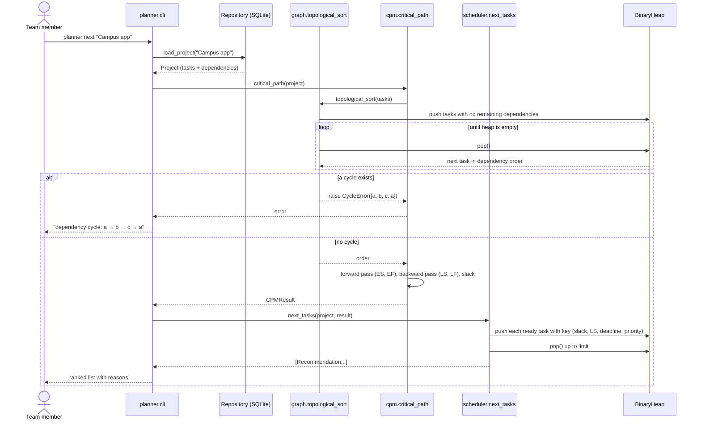
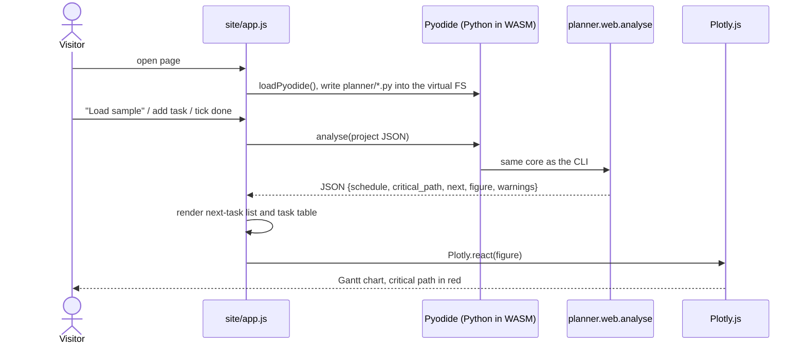

# Sequence diagrams

## "What should I do next?" (command line)

```mermaid
sequenceDiagram
    actor U as Team member
    participant CLI as planner.cli
    participant R as Repository (SQLite)
    participant G as graph.topological_sort
    participant C as cpm.critical_path
    participant S as scheduler.next_tasks
    participant H as BinaryHeap

    U->>CLI: planner next "Campus app"
    CLI->>R: load_project("Campus app")
    R-->>CLI: Project (tasks + dependencies)
    CLI->>C: critical_path(project)
    C->>G: topological_sort(tasks)
    G->>H: push tasks with no remaining dependencies
    loop until heap is empty
        G->>H: pop()
        H-->>G: next task in dependency order
    end
    alt a cycle exists
        G-->>C: raise CycleError([a, b, c, a])
        C-->>CLI: error
        CLI-->>U: "dependency cycle: a → b → c → a"
    else no cycle
        G-->>C: order
        C->>C: forward pass (ES, EF), backward pass (LS, LF), slack
        C-->>CLI: CPMResult
        CLI->>S: next_tasks(project, result)
        S->>H: push each ready task with key (slack, LS, deadline, priority)
        S->>H: pop() up to limit
        S-->>CLI: [Recommendation...]
        CLI-->>U: ranked list with reasons
    end
```

## Web demo (Pyodide)

```mermaid
sequenceDiagram
    actor V as Visitor
    participant JS as site/app.js
    participant PY as Pyodide (Python in WASM)
    participant W as planner.web.analyse
    participant P as Plotly.js

    V->>JS: open page
    JS->>PY: loadPyodide(), write planner/*.py into the virtual FS
    V->>JS: "Load sample" / add task / tick done
    JS->>PY: analyse(project JSON)
    PY->>W: same core as the CLI
    W-->>JS: JSON {schedule, critical_path, next, figure, warnings}
    JS->>JS: render next-task list and task table
    JS->>P: Plotly.react(figure)
    P-->>V: Gantt chart, critical path in red
```
