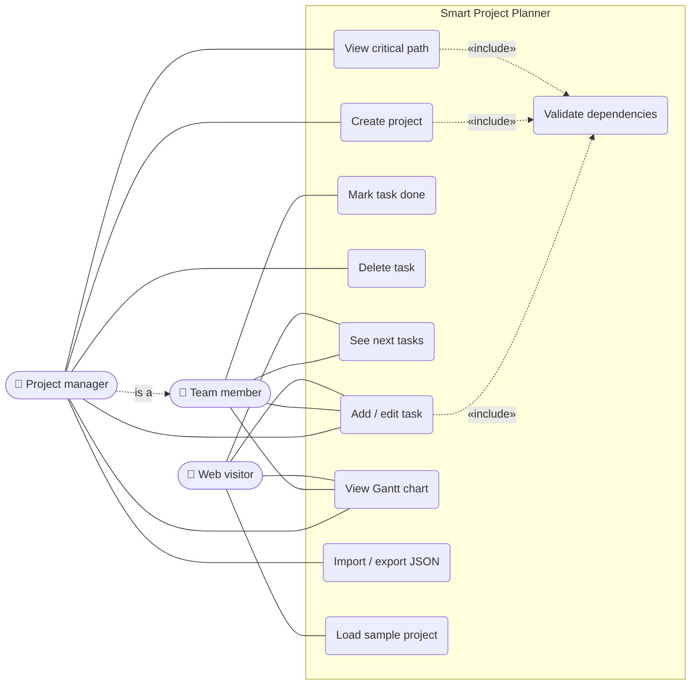

# Use-case diagram

Mermaid has no native use-case diagram, so this uses the common convention of
a flowchart: actors on the left, use cases (rounded) inside the system boundary.

```mermaid
flowchart LR
    TM([👤 Team member])
    PM([👤 Project manager])
    V([👤 Web visitor])

    subgraph SYS["Smart Project Planner"]
        UC1(Create project)
        UC2(Add / edit task)
        UC3(Mark task done)
        UC4(Delete task)
        UC5(See next tasks)
        UC6(View critical path)
        UC7(View Gantt chart)
        UC8(Import / export JSON)
        UC9(Load sample project)
        UC10(Validate dependencies)
    end

    PM --- UC1
    PM --- UC2
    PM --- UC4
    PM --- UC6
    PM --- UC7
    PM --- UC8
    TM --- UC2
    TM --- UC3
    TM --- UC5
    TM --- UC7
    V --- UC9
    V --- UC2
    V --- UC5
    V --- UC7

    UC2 -. "«include»" .-> UC10
    UC1 -. "«include»" .-> UC10
    UC6 -. "«include»" .-> UC10
    PM -. "is a" .-> TM
```
